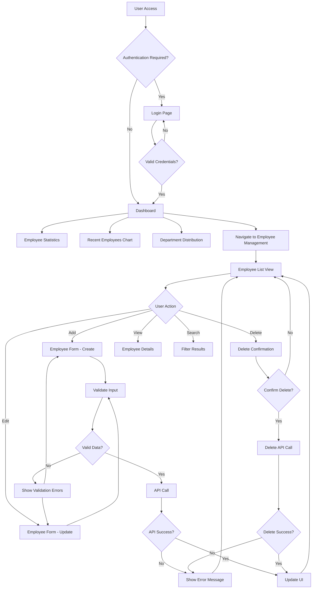
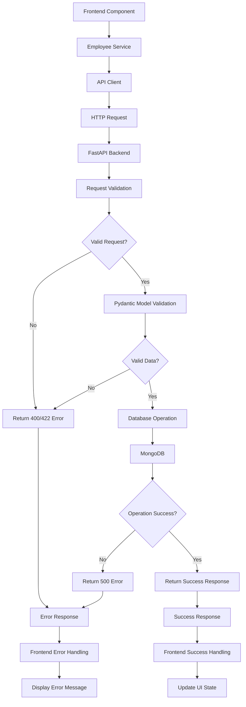
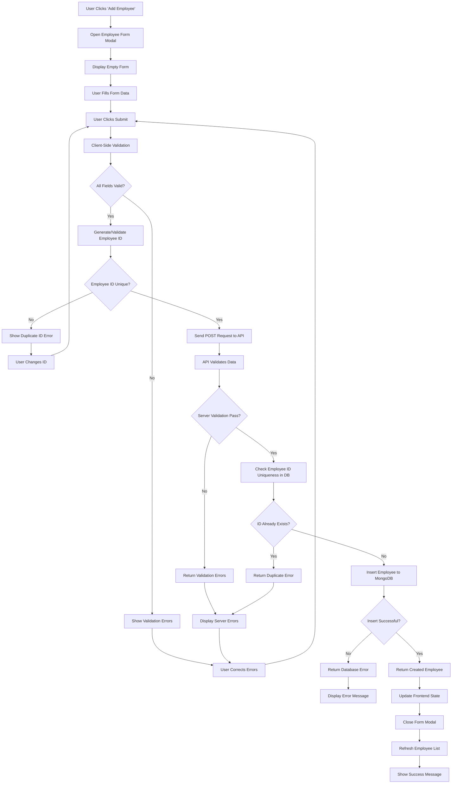
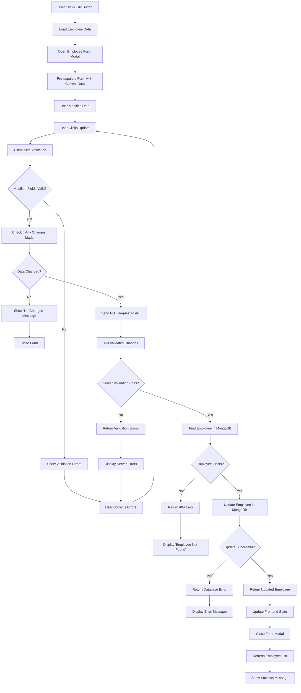
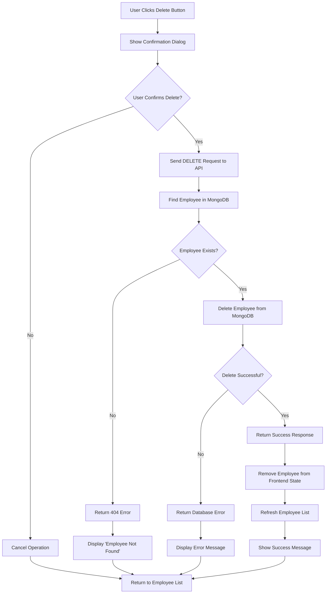
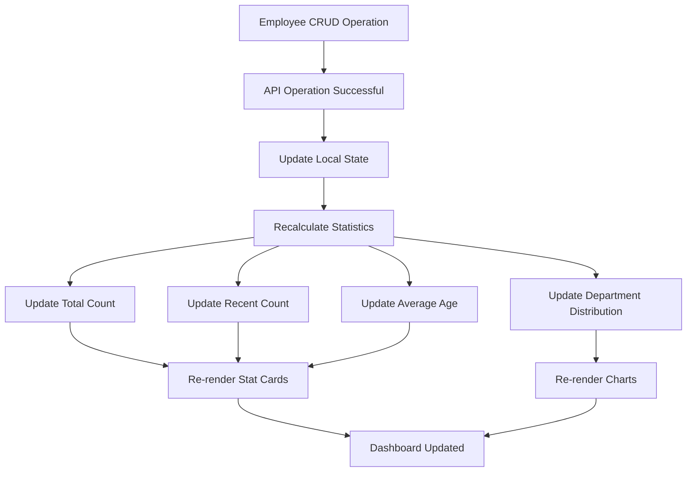
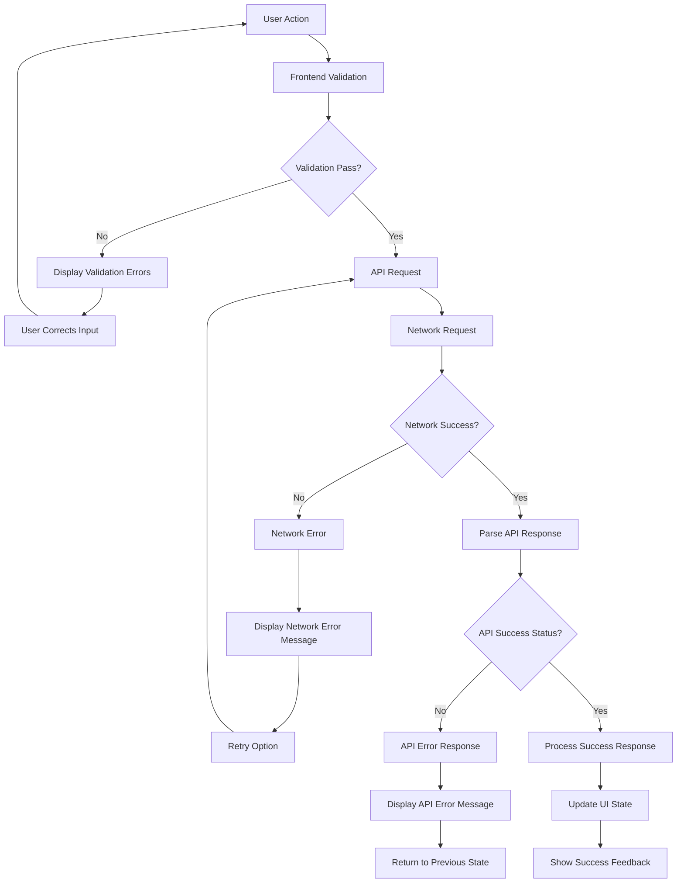
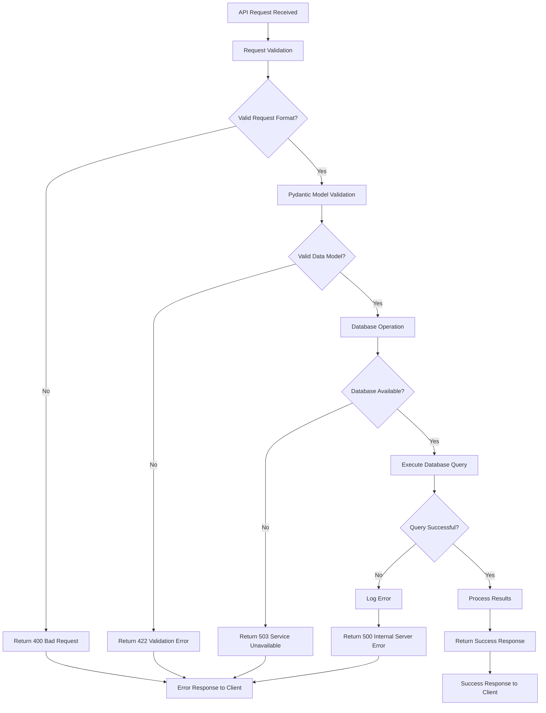
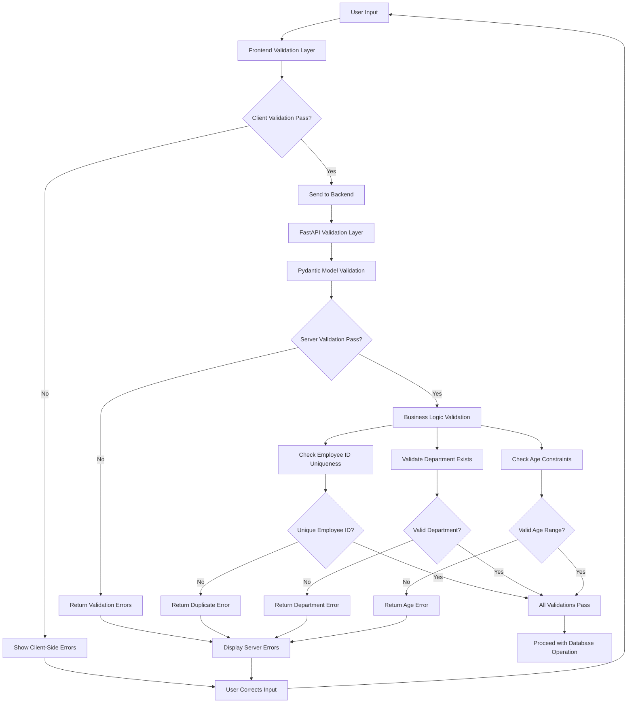
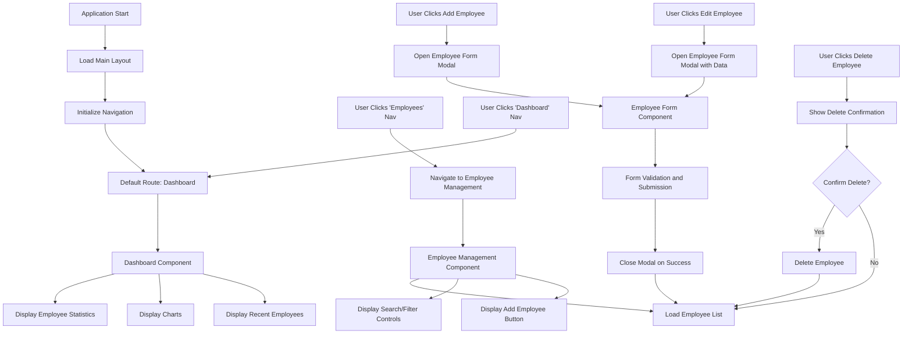

# System Flowchart Documentation
# Employee Management System

**Version**: 1.0  
**Date**: August 17, 2025  
**Purpose**: Visual representation of system logic and user flows  

---

## 1. System Architecture Flowchart

### 1.1 High-Level System Flow



---

## 2. API Request Flow

### 2.1 CRUD Operations Flow



---

## 3. Employee Management Workflow

### 3.1 Create Employee Flow



### 3.2 Update Employee Flow



### 3.3 Delete Employee Flow



---

## 4. Dashboard Data Flow

### 4.1 Dashboard Statistics Flow

```mermaid
graph TD
    A[User Navigates to Dashboard] --> B[Load Dashboard Component]
    B --> C[Fetch All Employees from API]
    C --> D[GET /api/v1/employees/]
    D --> E[Retrieve Employees from MongoDB]
    
    E --> F[Return Employee List]
    F --> G[Calculate Statistics]
    G --> H[Total Employee Count]
    G --> I[Recent Employees (3 months)]
    G --> J[Department Distribution]
    G --> K[Average Age]
    
    H --> L[Update Total Count Display]
    I --> M[Update Recent Count Display]
    I --> N[Filter Recent Employees List]
    J --> O[Generate Department Chart Data]
    K --> P[Update Average Age Display]
    
    O --> Q[Render Department Bar Chart]
    N --> R[Render Recent Employees Cards]
    
    L --> S[Dashboard Fully Loaded]
    M --> S
    P --> S
    Q --> S
    R --> S
```

### 3.2 Real-time Data Updates



---

## 5. Error Handling Flow

### 5.1 Client-Side Error Handling



### 5.2 Server-Side Error Handling



---

## 6. Data Validation Flow

### 6.1 Multi-Layer Validation



---

## 7. User Interface Flow

### 7.1 Navigation Flow



This comprehensive flowchart documentation provides visual representations of all major system flows, from high-level architecture to detailed user interactions and error handling scenarios. These flowcharts serve as a blueprint for implementation and help ensure all edge cases and user scenarios are properly handled.
